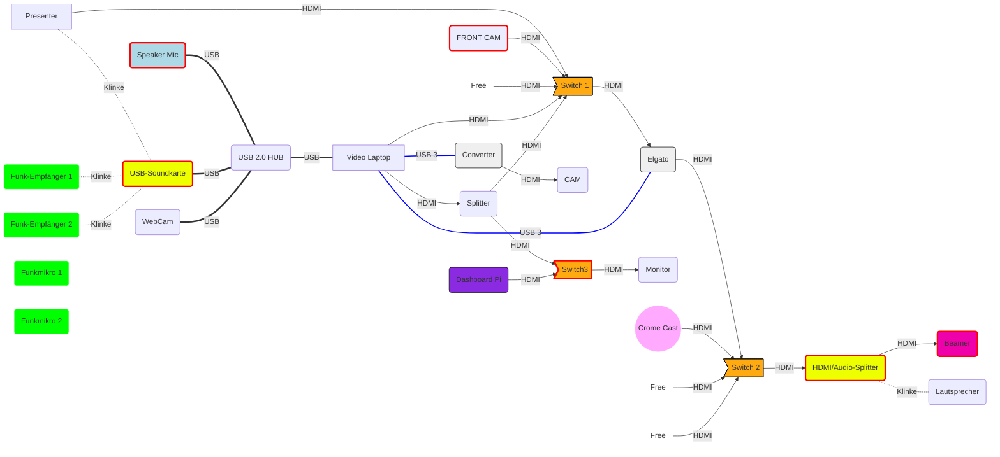
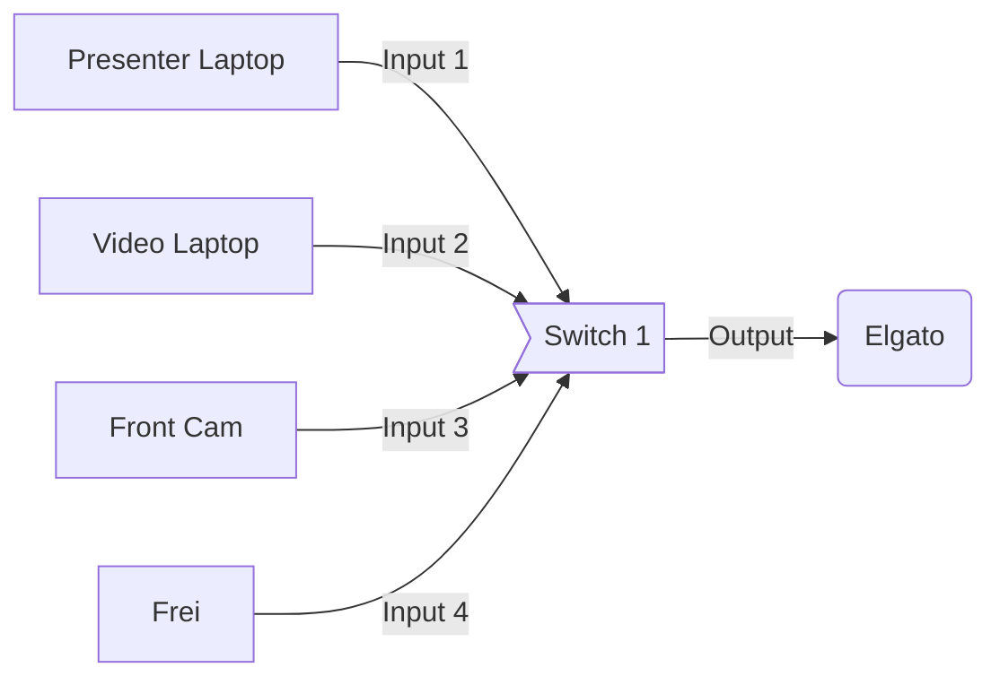
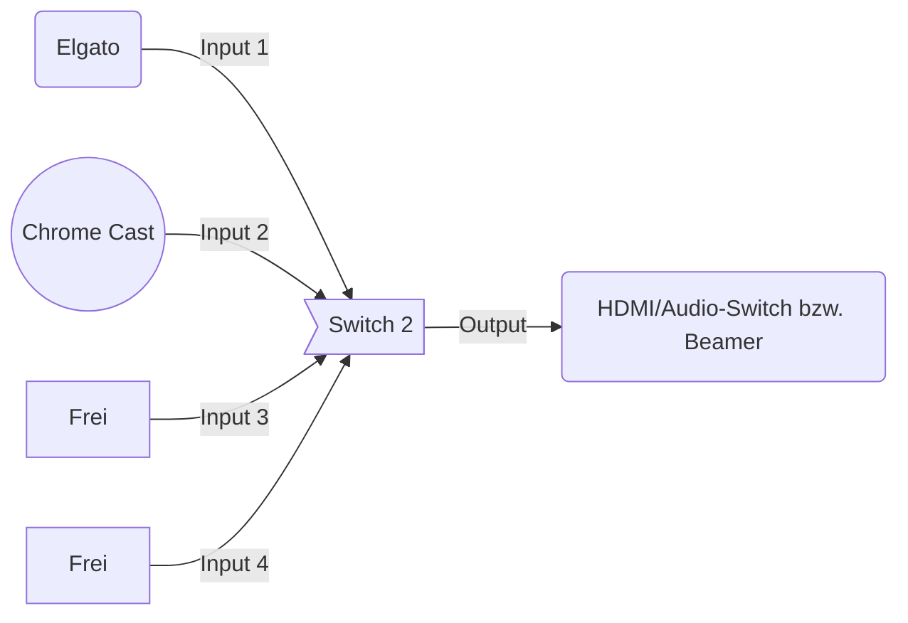
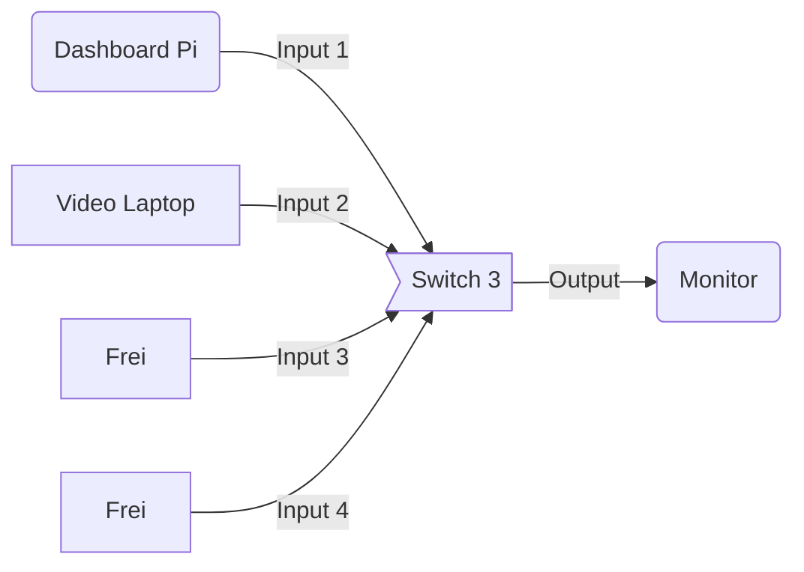

# VideoSetup für das Chaotikum

Das VideoSetup im Space befindet sich noch im Aufbau. Aktuell sind noch nicht
alle Elemente vorhanden. Einige sind Leihgaben.

_Außerdem ist gitlab blöd und in wirklichkeit ist das Diagram viel bunter und
besser._

   * **Presenter:** Ist der Laptop des Präsentierenden. *HDMI* steht zur
   Verfügung. *Klinke* ist langfristig angedacht. *VGA* vielleicht auch mal,
   lieber nur per Adapter.
   * **Switch1:** Ist ein mechanischer HDMI-Switch, in welchen die HDMI Ports
   gehen, welche in den Elgato gehen.
   * **Elgato:** Elgato greift das eingehende *HDMI* Signal ab und schickt es
   per USB 3.0 an den Video-Laptop.
   * **Switch2:** Einige Geräte können nicht durch den Elgato abgegriffen
   werden, da DRM-Dinge dies verhindern, diese können hier in den mechsnischen
   Switch eingehängt werden.
   * **HDMI/Audio-Splitter** Damit das Audio-Signal auf die Lautsprecher und
   nicht (nur) auf den beamer geht, wird es hier abgegriffen.
   * **Beamer:** Der Beamer ist halt der Beamer.
   * **Chrome Cast:** Google Chrome Cast.
   * **Switch3:** Der mechanische Switch entscheidet, welcher HDMI-Input auf den Monitor
   im hinteren Raumbereich
   * **Monitor:** Der Monitor hinten am Regal. DVI in.
   * **Front Cam:** Ein Camcorder, der sein Signal per HDMI ausgiebt, kann
   anstelle des Inputs vom Laptop angezeigt werden.**AKTUELL EXISTIERT DIESE
   KAMERA NOCH NICHT**
   * ...

## Belegung der Switches

### Switch 1

### Switch 2

### Switch 3

